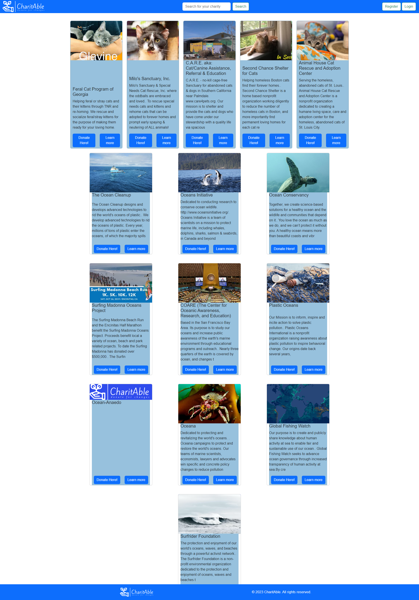

# CahritAble

## Desciption

Cahritable is a web Application whihc is meant to be a hub for chartiable doantions. It also serves as a way to keep track of your donations by tracking the amount and the chairty you have donated to.

## Table of Contents
- [Installation](#installation)

- [Usage](#usage)

- [Credits](#credits)

- [Testing](#testing)

- [Questions](#questioning)

- [License](#license)

## Installation

To install this app simply clone the repo.

## Usage

Once the repo is cloned run the "npm i" command in the root directory to install all the necessary npm packages.

## Credits 

This web application uses several node packages including:
- apollo-server-express
- faker-js
- bcrypt
- cookie-parser
- dotenv
- express
- graphql
- jsonwebtoken
- mongoose
- react
- bootstrap
- axios

The devs who created this web app include:
- [Michael Klein](#https://github.com/b0n3yard)
- [Ayman Shiham](#https://github.com/sharktank3800)
- [Stanislav Bazeliuk](#https://github.com/stasbaz)
- [Pablo Estrada](#https://github.com/Pestrada24)
- [Michael Edelstein](#https://github.com/MEdelsteinE)

## Testing

There are no tests for this web application at the current time.

## Questions

You can contact any of the devs with questions through Github or Email:
- b0n3yard@github.com
- sharktank3800@github.com
- stasbaz@github.com
- pestrada74@github.com
- MEdelsteinE@github.com

## License 

## Link to Deployed Web App

https://thawing-citadel-40079-6dfad7824281.herokuapp.com/

